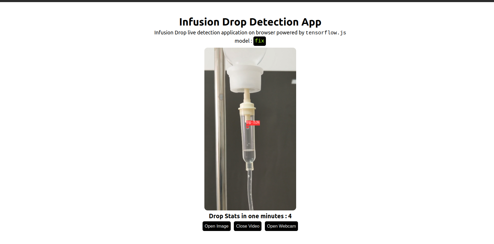

# Infusion Drop Object Detection using YOLOv8 and Tensorflow.js

<p align="center">
  
</p>


---

Object Detection application right in your browser. Serving YOLOv8 in browser using tensorflow.js
with `webgl` backend.

**Setup**

```bash
git clone https://github.com/afidzulinn/web-view-infusion.git
cd yolov8-tfjs
npm install
```

**Scripts**

```bash
npm start # Start dev server
```

## Model

YOLOv8l cutom trained model converted to tensorflow.js.

```
used model : yolov8l
```

**Use another model**

Use another YOLOv8 model.

1. Export YOLOv8 model to tfjs format. Read more on the [official documentation](https://docs.ultralytics.com/tasks/detection/#export)

   ```python
   from ultralytics import YOLO

   model = YOLO("yolov8l.pt")

   model.export(format="tfjs")
   ```

2. Copy `yolov8*_web_model` to `./public`
3. Update `modelName` in `App.jsx` to new model name
   ```jsx
   ...
   // model configs
   const modelName = "yolov8*"; // change to new model name
   ...
   ```
4. Done

Please update `src/utils/labels.json` with your new classes.

## Reference

- https://github.com/ultralytics/ultralytics
